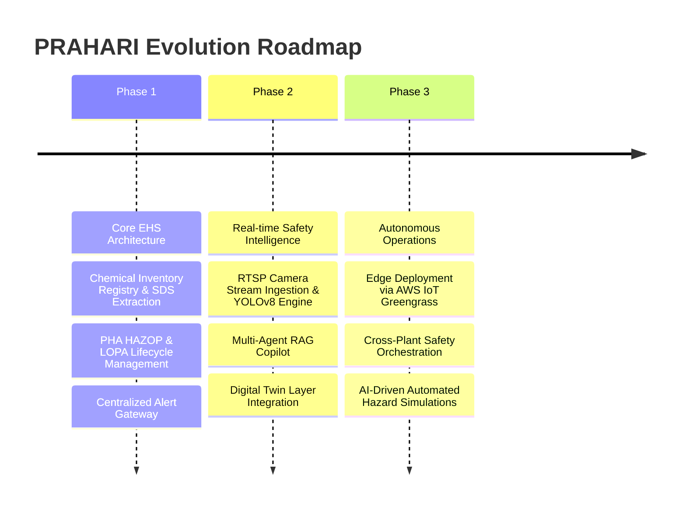

# PRAHARI Platform: Vision and Strategy

## 1. Project Vision
PRAHARI is a state-of-the-art, AI-powered Enterprise EHS (Environment, Health, and Safety) Platform designed to transition heavy industries from reactive risk mitigation to proactive safety intelligence. By merging traditional EHS processes with real-time computer vision inferencing, IoT edge analytics, distributed digital twins, and autonomous AI agents, PRAHARI provides an active safety shield for high-hazard operational environments.

---

## 2. Business Goals
- **Minimize Operational Hazards**: Drastically reduce Total Recordable Incident Rate (TRIR) and Days Away, Restricted, or Transferred (DART) metrics.
- **Ensure Compliance Zero-Defect**: Maintain absolute regulatory compliance with OSHA, EPA, EU REACH, Seveso III, and country-specific EHS frameworks.
- **Operational Efficiency**: Automate up to 75% of manual safety inspection reporting, incident logs compilation, and Safety Data Sheet (SDS) verification processes.
- **Reduce Risk Liability**: Provide auditable compliance logs that reduce corporate liability insurance premiums by demonstrating proactive, verifiable risk reduction.

---

## 3. Problem Statement
Heavy industries (chemical plants, refineries, mining sites, construction projects) operate in environments where minor oversights can lead to catastrophic losses, environmental disasters, or loss of human life. Existing EHS platforms suffer from major structural weaknesses:
1. **Reactive Designs**: They act as repositories of past incidents rather than tools for active prevention.
2. **Data Silos**: Real-time video feeds, IoT sensor telemetry, chemical storage states, and compliance documentation exist in completely disconnected silos.
3. **Manual Overhead**: Process Hazard Analysis (PHA) studies like HAZOP/LOPA and Management of Change (MOC) workflows require thousands of hours of manual coordination and are highly prone to human error.
4. **Poor Edge Operations**: Lack of processing capability at remote operations means latency-sensitive safety violations (e.g., lack of Personal Protective Equipment in hazardous zones) are detected too late.

---

## 4. Target Industries
- **Petrochemicals, Oil & Gas Refineries**
- **Chemical Production and Storage Facilities**
- **Mining, Ore Processing, and Smelting Operators**
- **Heavy Manufacturing, Steel Plants, and Automotive Assembly**
- **EPC (Engineering, Procurement, Construction) Mega-Projects**
- **Utilities, Power Generation, and Waste Treatment Sites**

---

## 5. Business Value
```
┌────────────────────────────────────────────────────────────────────────┐
│                        PRAHARI Business Value                          │
├───────────────────┬────────────────────────────┬───────────────────────┤
│ Operational Value │ Financial Value            │ Regulatory Value      │
├───────────────────┼────────────────────────────┼───────────────────────┤
│ • Real-time alerts│ • Lower insurance premiums │ • Audit readiness     │
│ • Lower accident  │ • Reduced clean-up cost    │ • Prevent litigation  │
│   rates (TRIR)    │ • Zero regulatory fines    │ • ISO 45001 alignment │
└───────────────────┴────────────────────────────┴───────────────────────┘
```

---

## 6. Objectives
- **Active Incident Shielding**: Deploy computer vision pipelines targeting 99.5% accuracy in detecting PPE compliance and zone intrusion within 100ms.
- **Intelligent Process Safety**: Inject AI Agents into PHA and HAZOP tasks to automatically review engineering documents and suggest standard safeguards.
- **Dynamic Digital Twin**: Build virtual, real-time spatial representations of chemical inventory layouts showing live hazard metrics.

---

## 7. Scope

### Functional Scope
- **Process Hazard Analysis (PHA) Engine**: Lifecycle support for HAZOP, LOPA, FMEA, BowTie, What-If, and Pre-Start Safety Reviews (PSSR).
- **Intelligent Chemical Registry**: Automatic parsing of Safety Data Sheets (SDS) via AI agents, tracking container lifecycle, compatibility matrix analysis, and maximum allowable quantity (MAQ) enforcement.
- **Computer Vision (CV) Pipeline**: Real-time PPE detection, flame/smoke detection, slip-and-fall monitoring, and geofenced exclusion zone breaches.
- **Distributed Digital Twin**: Dynamic physical layout mapping showing chemical containers, sensor telemetry, and live hazard ratings.
- **Action Tracker & Workflows**: Multi-step approvals, automated remediation tracking, and notifications.

### Non-Functional Scope
- **Scalability**: Support for up to 100,000 active concurrent sensor streams and 5,000 high-definition camera feeds per tenant.
- **Latency**: P99 system response time of less than 200ms for APIs; critical CV-based alerts delivered in under 1.5 seconds.
- **Security**: Zero-Trust security paradigm, complete end-to-end data encryption (AES-256-GCM), and integration with AWS Secrets Manager and KMS.
- **High Availability**: Multi-region deployment with Active-Passive failover, targeting 99.99% overall platform uptime.

---

## 8. KPIs & Success Metrics
| Metric Category | Key Performance Indicator (KPI) | Target | Measurement Method |
| :--- | :--- | :--- | :--- |
| **Safety** | Total Recordable Incident Rate (TRIR) | < 0.5 | Annual OSHA Form 300 logs |
| **Latency** | Computer Vision Alert Trigger Time | < 500ms | OTel Trace Span measurements |
| **Accuracy** | SDS AI Agent Extraction Accuracy | > 99.2% | Weekly manual validation audits |
| **System** | Service Availability | 99.99% | Pingdom/Datadog Synthetics |
| **Process** | Average HAZOP Revalidation Cycle Time | -60% | Platform workflow analytics |

---

## 9. Product Roadmap & Future Vision



### Future Vision
By 2028, PRAHARI aims to become an autonomous EHS operational autopilot. Instead of operators manually reviewing camera logs and chemical charts, the system will use deep predictive simulations to identify safety failures *before* they materialize, coordinate with physical robotics to isolate chemical leaks, and automatically update digital twin representations, establishing a fully closed-loop industrial safety shield.
