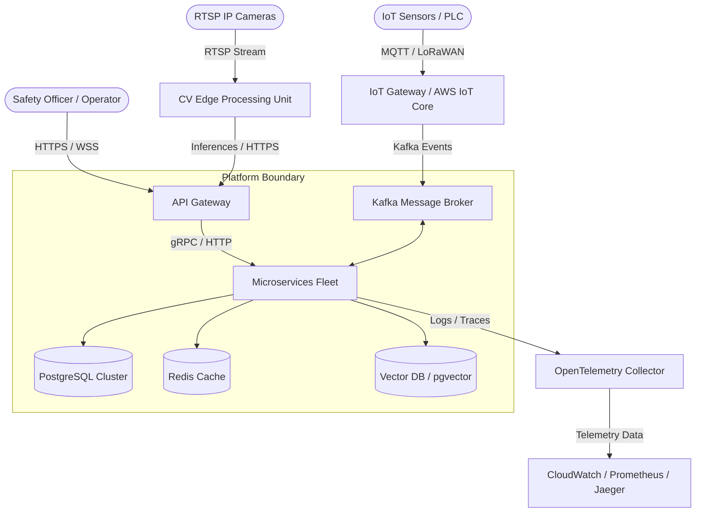
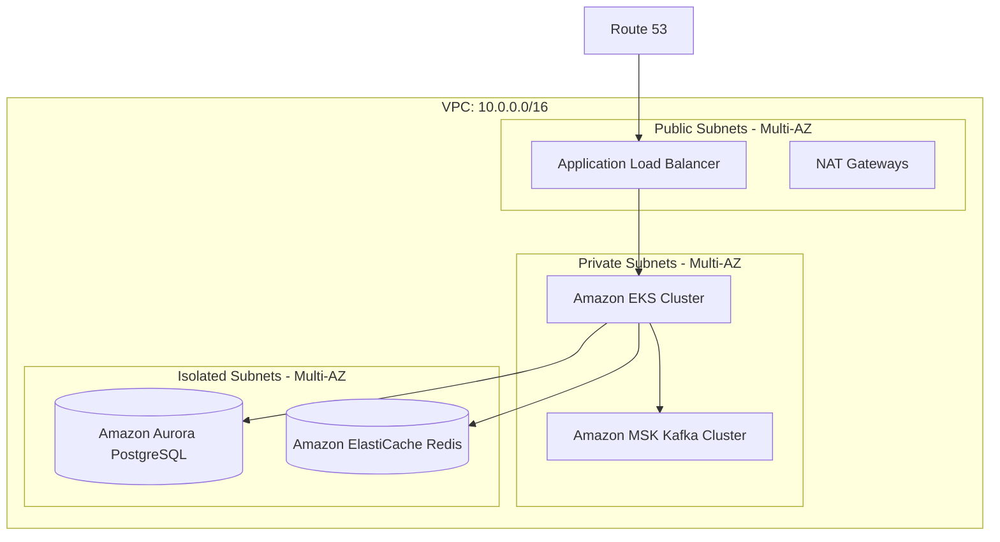
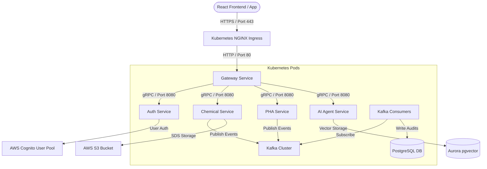
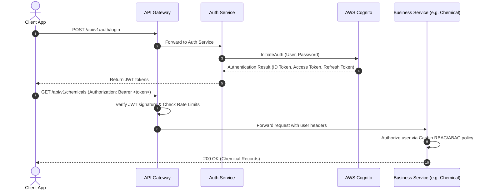
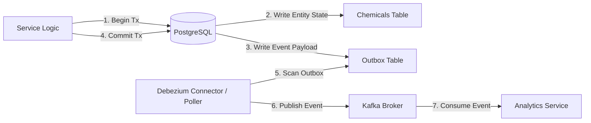

# PRAHARI Platform: High Level Design (HLD)

## 1. Executive Summary
This document defines the high-level system architecture of the PRAHARI Platform. PRAHARI uses a containerized, event-driven, and microservices-based design to support enterprise occupational health and safety requirements. The platform integrates traditional relational databases with distributed message brokers, vector search engines, computer vision inferencing runtimes, and multi-agent AI networks.

---

## 2. Architecture Principles
- **Separation of Concerns**: Enforce strict boundary layers through clean, hexagonal code structures.
- **Event-Driven Asynchrony**: Offload latency-tolerant processes to Kafka message brokers.
- **Stateless Services**: Ensure scalability by keeping application containers free of local session state.
- **Fail-Secure Defaults**: Deny access by default (Zero-Trust) and isolate network spaces.
- **Continuous Observability**: Track all actions through tracing, structured logging, and real-time metrics.

---

## 3. System Context
The following diagram illustrates how external systems and users interact with the PRAHARI Platform boundary.

---

## 4. Enterprise Architecture & Service Landscape
The platform core consists of specialized microservices communicating via REST (external), gRPC (internal synchronous), and Kafka (asynchronous).

- **Gateway Service**: Envoy-based API Gateway handling SSL termination, CORS, routing, and rate limiting.
- **Auth & User Services**: Coordinates authentication with AWS Cognito and manages tenancy, RBAC, and ABAC profiles.
- **Chemical Service**: Manages chemical registration, SDS lifecycles, and storage compatibility audits.
- **PHA Service**: Manages Process Hazard Analysis studies, HAZOP matrices, LOPA evaluations, and checklist executions.
- **Incident Service**: Manages the incident intake pipeline, investigations, root cause analyses, and action assignments.
- **AI Agent Service**: Orchestrates LangGraph-based AI agents, vector indexing, RAG, and safety summaries.
- **CV Inference Service**: Tracks cameras, ingests edge inferences, manages YOLO model configs, and triggers alarms.
- **Digital Twin Service**: Correlates chemical spatial data, IoT events, and visual feeds to present plant safety twins.

---

## 5. Deployment Topology (AWS Architecture)
The platform is deployed inside a multi-Availability Zone (AZ) Amazon Virtual Private Cloud (VPC) segregated into public, private, and isolated subnets.

---

## 6. Container Architecture (C4 Level 2)
The container diagram details the runtime components and communications within the EKS namespace.

---

## 7. Core Flows & Integration

### 7.1 Authentication & Authorization Flow

### 7.2 Async Transactional Outbox Pattern
To prevent distributed transaction failures, all microservices write state changes and events to a local PostgreSQL database inside a single database transaction, after which a CDC (Change Data Capture) system or dedicated Outbox Poller publishes the events to Kafka.

---

## 8. Layer Integration Specifications

### 8.1 Caching Layer (Redis)
- **Cache-Aside Pattern**: Read requests query Redis first. On cache miss, fetch from PostgreSQL, write back to Redis (TTL 3600s).
- **Distributed Locks**: Use Redlock algorithm on Redis to serialize operations on high-concurrency entities (e.g., container transfer actions).
- **Rate Limiting**: Sliding window rate-limiting metrics stored inside Redis sorted sets.

### 8.2 Streaming Layer (Kafka)
- **Topic Naming Convention**: `<tenant_id>.<domain_area>.<entity_type>.<event_action>` (e.g. `1001.ehs.chemical.created`).
- **Partitioning Strategy**: Partition keys mapped to `plant_id` to ensure strictly ordered event processing per physical plant site.
- **Dead Letter Queue (DLQ)**: Failed events write to dedicated DLQ topics (e.g. `prahari.ehs.chemical.created.dlq`) with exponential backoff retry consumers.

### 8.3 Observability Layer (OpenTelemetry)
- **Context Propagation**: Trace context propagated using W3C Trace Context standard (`traceparent` header) across HTTP, gRPC, and Kafka metadata.
- **Log Aggregation**: Structured JSON logs scraped via fluent-bit and shipped to AWS CloudWatch.
- **Metrics Scraping**: Prometheus pulls JVM, Go, EKS, and business metrics, sending alerts via Alertmanager.

---

## 9. Disaster Recovery & High Availability
- **Multi-AZ Availability**: All microservice workloads replicate across three Availability Zones. Primary databases use multi-AZ synchronous replication with automatic failover.
- **Cross-Region Replication**: Database transactions replicate asynchronously to a secondary AWS DR region. S3 assets replicate via cross-region replication.
- **Failover Plan**: Route 53 DNS routing policies switch customer traffic to the secondary region if the primary region experiences service degradation.
