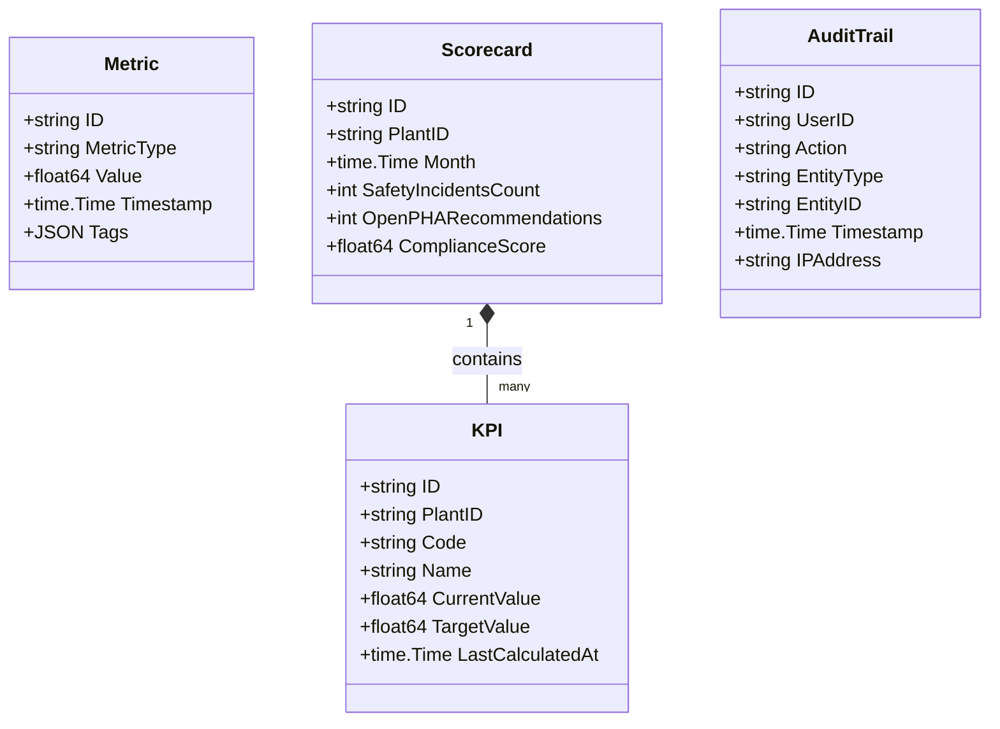
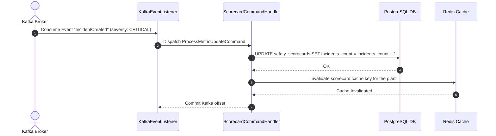

# Analytics & Incident Intelligence Microservice: Low Level Design

## 1. Purpose & Responsibilities
The Analytics Service aggregates real-time data from chemical tracking, PHA recommendation lifecycles, and computer vision safety violations to build plant-level safety scorecards, calculate TRIR metrics, and export compliance reports.

---

## 2. Domain Model
The domain focuses on metrics, safety scorecards, and audit logs.



---

## 3. Database Schema
PostgreSQL is configured with partitioning on metrics tables to support time-series data ingest.

```sql
CREATE TABLE safety_scorecards (
    id VARCHAR(36) PRIMARY KEY,
    plant_id VARCHAR(36) NOT NULL,
    month DATE NOT NULL,
    incidents_count INT DEFAULT 0,
    open_recs_count INT DEFAULT 0,
    compliance_score NUMERIC(5, 2) NOT NULL,
    created_at TIMESTAMP WITH TIME ZONE DEFAULT NOW(),
    updated_at TIMESTAMP WITH TIME ZONE DEFAULT NOW(),
    UNIQUE(plant_id, month)
);

CREATE TABLE platform_metrics (
    id VARCHAR(36) NOT NULL,
    metric_type VARCHAR(100) NOT NULL,
    value NUMERIC(15, 4) NOT NULL,
    timestamp TIMESTAMP WITH TIME ZONE NOT NULL,
    tags JSONB,
    PRIMARY KEY (id, timestamp)
) PARTITION BY RANGE (timestamp);
```

---

## 4. Sequence Diagrams
The following sequence details how safety metrics are updated asynchronously from Kafka incident and recommendation topics.



---

## 5. API Definitions

### REST APIs
- `GET /api/v1/analytics/scorecards/plant/{plant_id}` - Retrieve active month safety scorecard.
- `GET /api/v1/analytics/metrics` - Query raw safety telemetry (filterable by tag, time range).
- `POST /api/v1/analytics/exports` - Schedule an asynchronous export (CSV/PDF) of audit trails.

---

## 6. Messaging & Cache Layer Configurations

### Kafka Consumers (Topics List)
- Subscribes to `prahari.ehs.pha.recommendation_assigned`
- Subscribes to `prahari.ehs.container.transferred`
- Subscribes to `prahari.ehs.cv.alert_triggered`

### Redis Cache Keys
- `analytics:scorecard:monthly:<plant_id>:<month_date>` - JSON representation of the safety scorecard (TTL: 15 minutes).

---

## 7. Business and Validation Rules
- **Rule 01 (TRIR Calculation)**: Total Recordable Incident Rate is calculated as: `(Total Incidents * 200,000) / Total Productive Hours Worked`. Work hours updates are synced from the Organization Service.
- **Rule 02 (Compliance Score Deduction)**: A plant's baseline compliance score of 100 is deducted by:
  - 10 points per open overdue PHA recommendation.
  - 15 points per critical computer vision PPE alert unacknowledged after 30 minutes.
  - 50 points per regulatory compliance breach event.
