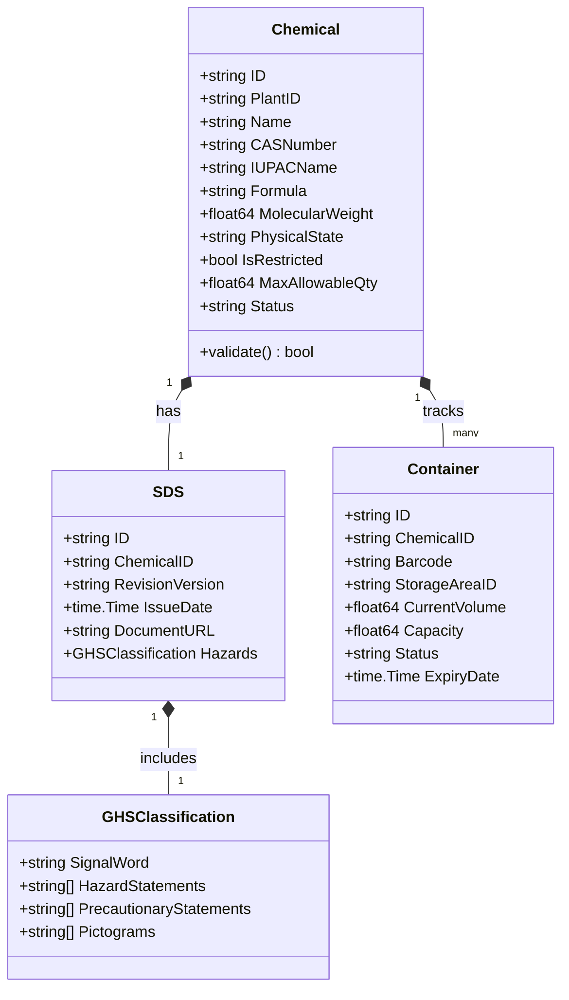
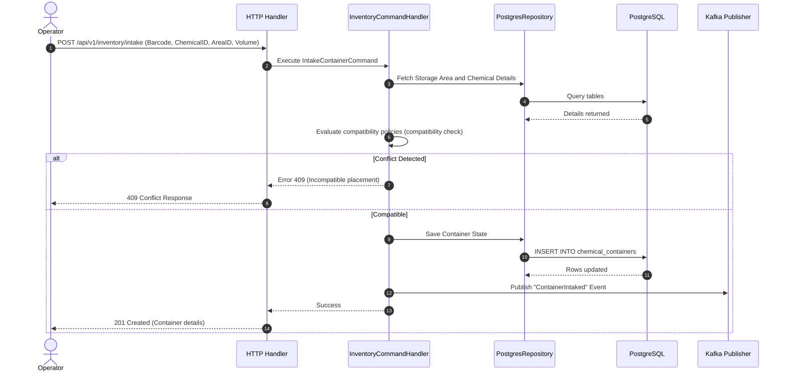

# Chemical Management Microservice: Low Level Design

## 1. Purpose & Responsibilities
The Chemical Service serves as the authoritative system of record for all hazardous and non-hazardous chemicals on site. It tracks chemical master records, Safety Data Sheets (SDS), physical container lifecycles, and compatibility rules to prevent accidental chemical reactions.

---

## 2. Domain Model
The service uses Domain-Driven Design (DDD). The primary Aggregate Roots are `Chemical` and `ChemicalInventory` (representing physical storage areas and containers).



---

## 3. Database Schema
PostgreSQL is used as the transactional store.

```sql
CREATE TABLE chemicals (
    id VARCHAR(36) PRIMARY KEY,
    plant_id VARCHAR(36) NOT NULL,
    name VARCHAR(255) NOT NULL,
    cas_number VARCHAR(50) NOT NULL UNIQUE,
    iupac_name VARCHAR(255),
    formula VARCHAR(100),
    molecular_weight NUMERIC(10, 4),
    physical_state VARCHAR(20) NOT NULL,
    is_restricted BOOLEAN DEFAULT FALSE,
    max_allowable_qty NUMERIC(12, 3),
    status VARCHAR(50) NOT NULL,
    created_at TIMESTAMP WITH TIME ZONE DEFAULT NOW(),
    updated_at TIMESTAMP WITH TIME ZONE DEFAULT NOW()
);

CREATE TABLE chemical_containers (
    id VARCHAR(36) PRIMARY KEY,
    chemical_id VARCHAR(36) REFERENCES chemicals(id),
    barcode VARCHAR(100) NOT NULL UNIQUE,
    storage_area_id VARCHAR(36) NOT NULL,
    current_volume NUMERIC(12, 3) NOT NULL,
    capacity NUMERIC(12, 3) NOT NULL,
    status VARCHAR(50) NOT NULL,
    expiry_date TIMESTAMP WITH TIME ZONE,
    created_at TIMESTAMP WITH TIME ZONE DEFAULT NOW(),
    updated_at TIMESTAMP WITH TIME ZONE DEFAULT NOW()
);
```

---

## 4. Sequence Diagrams
The following sequence shows the intake of a chemical container, verifying SDS hazards and compatibility.



---

## 5. API Definitions

### REST APIs
- `POST /api/v1/chemicals` - Register a new chemical master.
- `GET /api/v1/chemicals/{id}` - Fetch chemical master detail.
- `POST /api/v1/chemicals/{id}/sds` - Upload and parse SDS PDF file.
- `POST /api/v1/inventory/containers` - Record container intake.
- `PUT /api/v1/inventory/containers/{id}/transfer` - Transfer container to another storage zone.

### gRPC APIs
- `rpc GetChemicalDetails(GetChemicalRequest) returns (GetChemicalResponse)`
- `rpc CheckStorageCompatibility(CompatibilityRequest) returns (CompatibilityResponse)`

---

## 6. Messaging & Cache Layer Configurations

### Kafka Topics
- `prahari.ehs.chemical.created` - Emitted when a new chemical master is registered.
- `prahari.ehs.container.transferred` - Emitted when a chemical container is physically moved.

### Redis Cache Key Schema
- `chemical:master:<chemical_id>` - Holds JSON representation of the chemical record (TTL: 1 hour).
- `chemical:compatibility:<group_a>:<group_b>` - Compatibility classification matrix value (boolean compatibility, TTL: Permanent).

---

## 7. Business and Validation Rules
- **Rule 01 (Max Quantity Enforced)**: Total aggregate volume of any GHS Category 1 flammable chemical inside Fire Zone A must not exceed 500 liters.
- **Rule 02 (Incompatibility Audit)**: Acidic solutions (pH < 4.0) must not be located within the same spill tray or 3 meters of basic solutions (pH > 10.0).
- **Rule 03 (SDS Verification)**: No container intake is permitted if the associated chemical master record does not have an approved SDS revision dated within the last 3 years.

---

## 8. Resilience, Observability & Security
- **Resilience**: Database connections use a circuit breaker configured via `prahari/shared/resilience/circuitbreaker`. If connection timeout exceeds 500ms for 5 consecutive operations, the breaker trips.
- **Security**: The storage locations of SDS files on S3 are signed via KMS encryption, and all container barcode values are sanitized using JWT verification rules.
- **Logging**: Structured logs are emitted containing context fields: `chemical_id`, `plant_id`, and active OTel `trace_id`.
- **Metrics**: Exposes `prahari_chemical_registered_total` and `prahari_container_intake_failures_total`.
