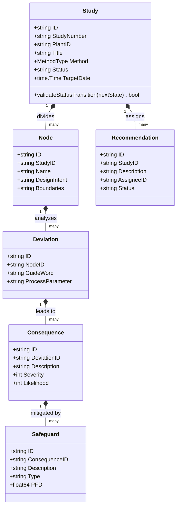
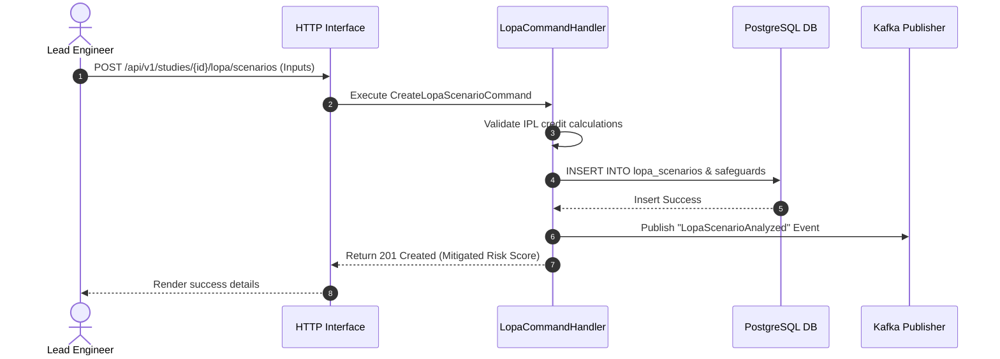

# Process Hazard Analysis (PHA) Microservice: Low Level Design

## 1. Purpose & Responsibilities
The PHA Service governs the lifecycle of process safety studies (HAZOP, LOPA, BowTie, etc.). It enables engineering teams to document process deviations, evaluate unmitigated risk, assign risk reduction action items, and audit safeguards.

---

## 2. Domain Model
The core aggregate root is the `Study`. A Study contains multiple Nodes, which in turn contain Deviations.



---

## 3. Database Schema
PostgreSQL manages the hierarchical PHA tables.

```sql
CREATE TABLE pha_studies (
    id VARCHAR(36) PRIMARY KEY,
    study_number VARCHAR(100) NOT NULL UNIQUE,
    plant_id VARCHAR(36) NOT NULL,
    unit_id VARCHAR(36) NOT NULL,
    title VARCHAR(255) NOT NULL,
    description TEXT,
    method VARCHAR(50) NOT NULL, -- HAZOP, LOPA, BOWTIE, FMEA
    moc_id VARCHAR(36),
    status VARCHAR(50) NOT NULL,
    leader_id VARCHAR(36) NOT NULL,
    scribe_id VARCHAR(36) NOT NULL,
    target_date TIMESTAMP WITH TIME ZONE NOT NULL,
    revalidation_due_at TIMESTAMP WITH TIME ZONE,
    created_at TIMESTAMP WITH TIME ZONE DEFAULT NOW(),
    updated_at TIMESTAMP WITH TIME ZONE DEFAULT NOW()
);

CREATE TABLE hazop_nodes (
    id VARCHAR(36) PRIMARY KEY,
    study_id VARCHAR(36) REFERENCES pha_studies(id) ON DELETE CASCADE,
    name VARCHAR(255) NOT NULL,
    design_intent TEXT NOT NULL,
    boundaries TEXT,
    created_at TIMESTAMP WITH TIME ZONE DEFAULT NOW()
);

CREATE TABLE process_deviations (
    id VARCHAR(36) PRIMARY KEY,
    node_id VARCHAR(36) REFERENCES hazop_nodes(id) ON DELETE CASCADE,
    guideword VARCHAR(100) NOT NULL,
    parameter VARCHAR(100) NOT NULL
);

CREATE TABLE consequences (
    id VARCHAR(36) PRIMARY KEY,
    deviation_id VARCHAR(36) REFERENCES process_deviations(id) ON DELETE CASCADE,
    description TEXT NOT NULL,
    severity INT NOT NULL,
    likelihood INT NOT NULL,
    risk_rank INT NOT NULL
);
```

---

## 4. Sequence Diagrams
Workflow representation for creating a recommendation and linking it to a LOPA study.



---

## 5. API Definitions

### REST APIs
- `POST /api/v1/studies` - Create a new PHA study.
- `GET /api/v1/studies/{id}` - Fetch study structure hierarchy.
- `POST /api/v1/studies/{id}/nodes` - Append node to study.
- `POST /api/v1/nodes/{id}/deviations` - Add deviation analysis matrix.
- `POST /api/v1/studies/{id}/recommendations` - Raise safety action items.

### gRPC APIs
- `rpc GetStudyStructure(StudyRequest) returns (StudyResponse)`
- `rpc VerifyActionItemStatus(ActionRequest) returns (ActionResponse)`

---

## 6. Messaging & Cache Layer Configurations

### Kafka Topics
- `prahari.ehs.pha.study_created` - Emitted upon creation of a new PHA study.
- `prahari.ehs.pha.recommendation_assigned` - Emitted when a safety action item is designated to an engineer.

---

## 7. Business and Validation Rules
- **Rule 01 (OSHA Revalidation)**: The `revalidation_due_at` field must be set to exactly 5 years from study completion date for any plant operating under OSHA PSM criteria.
- **Rule 02 (LOPA Safeguard PFD)**: Any safeguard designated as an Independent Protection Layer (IPL) must possess a Probability of Failure on Demand (PFD) value less than 0.1, and meet the audit checks for specificity, independence, and dependability.
- **Rule 03 (Risk Acceptance)**: If the final mitigated risk rank remains higher than the site risk tolerance threshold, the study cannot progress to the "Closed" status without an active recommendation attached.
