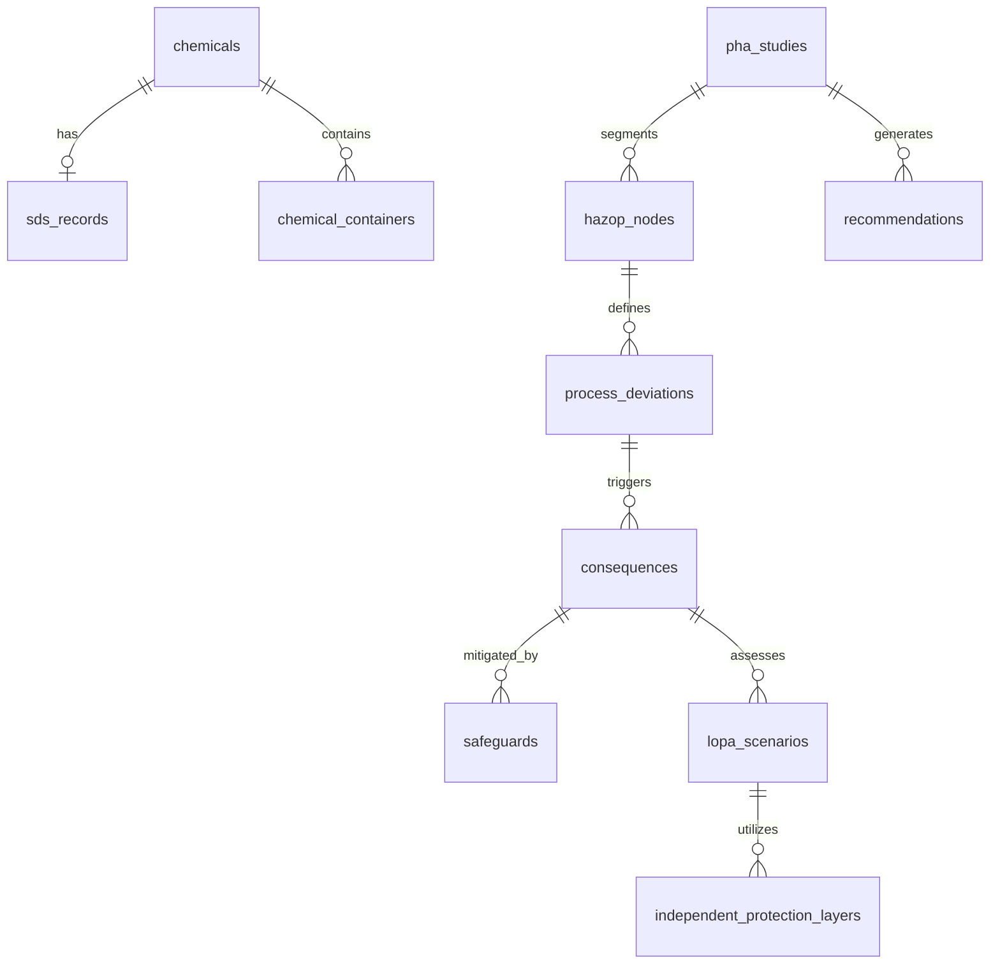

# PRAHARI Platform: Database Design and Schema Specification

## 1. Entity Relationship (ER) Diagram
The transactional databases in PRAHARI are partitioned per domain boundary (Database-per-Service pattern). The diagrams below depict the relational mappings inside the Chemical and PHA database instances.



---

## 2. Table Definitions & Schemas

### 2.1 SDS Records Table (`sds_records`)
Stores safety details parsed from PDFs.
```sql
CREATE TABLE sds_records (
    id VARCHAR(36) PRIMARY KEY,
    chemical_id VARCHAR(36) NOT NULL REFERENCES chemicals(id) ON DELETE CASCADE,
    revision_version VARCHAR(20) NOT NULL,
    issue_date DATE NOT NULL,
    document_url VARCHAR(512) NOT NULL,
    signal_word VARCHAR(50) NOT NULL,
    hazard_statements VARCHAR(255)[] NOT NULL,
    precautionary_statements VARCHAR(255)[] NOT NULL,
    created_at TIMESTAMP WITH TIME ZONE DEFAULT NOW()
);
```

### 2.2 Recommendations Table (`recommendations`)
Tracks action items arising from studies.
```sql
CREATE TABLE recommendations (
    id VARCHAR(36) PRIMARY KEY,
    study_id VARCHAR(36) NOT NULL REFERENCES pha_studies(id) ON DELETE CASCADE,
    node_id VARCHAR(36) REFERENCES hazop_nodes(id) ON DELETE SET NULL,
    description TEXT NOT NULL,
    assignee_id VARCHAR(36) NOT NULL,
    status VARCHAR(50) NOT NULL, -- ASSIGNED, IN_PROGRESS, RESOLVED, VERIFIED
    due_date TIMESTAMP WITH TIME ZONE NOT NULL,
    resolved_at TIMESTAMP WITH TIME ZONE,
    created_at TIMESTAMP WITH TIME ZONE DEFAULT NOW(),
    updated_at TIMESTAMP WITH TIME ZONE DEFAULT NOW()
);
```

---

## 3. Database Indexes & Performance
To optimize high-concurrency read queries (e.g., compatibility verification during warehouse sweeps), the following indexes are constructed:

```sql
-- Fast index lookup for chemical CAS numbers
CREATE UNIQUE INDEX idx_chemicals_cas ON chemicals(cas_number);

-- Index for searching containers by storage area and chemical ID
CREATE INDEX idx_containers_storage_chem ON chemical_containers(storage_area_id, chemical_id);

-- GIN Index for fast lookup inside array fields of SDS record hazard statements
CREATE INDEX idx_sds_hazards ON sds_records USING GIN (hazard_statements);

-- Index on recommendation assignee and status
CREATE INDEX idx_recs_assignee_status ON recommendations(assignee_id, status);
```

---

## 4. Partitioning & Retention Strategy
We partition historical audit trails and metrics to prevent database bloat.

- **Time-Series Partitioning**: The `platform_metrics` table is partitioned monthly based on the `timestamp` column.
- **Partition Creation**: Automated CRON jobs running in Kubernetes execute SQL commands weekly to pre-create partitions for the upcoming month:
  ```sql
  CREATE TABLE platform_metrics_y2026m08 PARTITION OF platform_metrics
      FOR VALUES FROM ('2026-08-01 00:00:00+00') TO ('2026-09-01 00:00:00+00');
  ```
- **Data Retention Policies**:
  - **Raw Metrics**: Partition tables are detached and moved to cold storage (AWS S3 Glacier) after 90 days.
  - **Audit Logs**: Maintained for 7 years in PostgreSQL partitions before archiving to write-once-read-many (WORM) S3 buckets to satisfy compliance regulations.

---

## 5. DB Migration Strategy
- **Framework**: Migrations are written in raw SQL and executed using **Golang Migrate** library built into the microservices bootstrap pipeline.
- **Rules**:
  - All migrations must be write-only schema modifications (forward migrations).
  - Down-migrations (`.down.sql` scripts) are kept in the source tree but are NEVER run automatically in production. 
  - Structural modifications to active columns are handled in a 3-step release: (1) Add new column, (2) Backfill data, (3) Deprecate old column.

---

## 6. Backup & Recovery Topography
- **Automated Backups**: AWS RDS Aurora clusters configured for daily automated snapshot back-ups with a 30-day retention window.
- **Continuous Backups**: Aurora Point-in-Time Recovery (PITR) is activated with transaction log archiving every 5 minutes.
- **Cross-Region Copy**: Snapshots copy automatically to AWS secondary region (`us-west-2`) using custom KMS key translation configurations.
