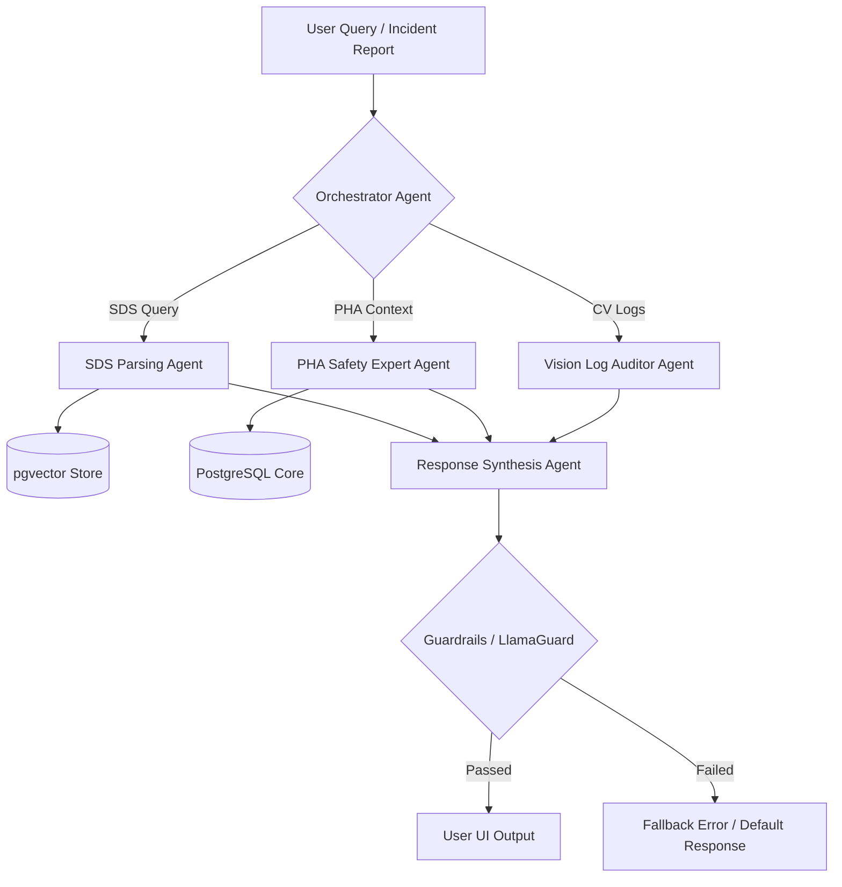

# PRAHARI Platform: AI and Multi-Agent Architecture

## 1. Agent Architecture
The AI capabilities of PRAHARI are built around a multi-agent orchestration pattern implemented using **LangGraph** (Python template in `templates/ai-agent-template`). Instead of single LLM completions, specialized agents cooperate to solve safety tasks.



- **Orchestrator Agent**: Decodes query intent, routes processing branches, and compiles local memory state.
- **SDS Parsing Agent**: Extracts compound metrics, identifies GHS classes, and checks against REACH criteria.
- **PHA Safety Expert Agent**: Reviews HAZOP matrices and drafts recommendations based on past node deviations.
- **Vision Log Auditor Agent**: Correlates alerts and determines PPE violation frequencies.

---

## 2. Memory System
Agents maintain a multi-tier memory system:
- **Short-Term Memory**: Conversation thread buffer stored in Redis, keeping context from the last 10 messages of active sessions.
- **Long-Term Memory**: Relational profiles of user preferences, plant configurations, and active project focus areas stored in PostgreSQL.
- **Semantic Memory**: Embeddings of previous query-response cycles stored in pgvector to resolve recurring hazard definitions.

---

## 3. RAG Pipeline & Vector Database
We use **pgvector** inside Amazon Aurora PostgreSQL for semantic document searches.

### 3.1 Embedding Pipeline
1. **Document Ingest**: PDFs (e.g. Safety Data Sheets, standard operating procedures) are parsed and split into chunks of 512 tokens using recursive character text splitters with a 50-token overlap.
2. **Vector Generation**: Text chunks are passed to the `text-embedding-3-small` OpenAI API endpoint or local HuggingFace sentence-transformers.
3. **Indexing**: Generated vectors (1536 dimensions) are stored in PostgreSQL with **HNSW (Hierarchical Navigable Small World)** indexing to ensure latency-sensitive lookups:
   ```sql
   CREATE INDEX idx_sds_embeddings_hnsw ON sds_embeddings 
   USING hnsw (embedding vector_cosine_ops) WITH (m = 16, ef_construction = 64);
   ```

### 3.2 Retrieval Logic
We apply a hybrid retrieval strategy: Keyword matching (using PostgreSQL tsvector) is combined with Cosine Similarity vector searches. The top 5 results are passed to a reranker (e.g. Cohere Rerank) to produce the final 3 context blocks fed to the prompt context window.

---

## 4. Prompt Design & Guardrails

### 4.1 System Prompt Pattern
```text
SYSTEM: You are the Lead Safety Assistant on the PRAHARI EHS Platform.
Your purpose is to assist engineers with Process Hazard Analysis (PHA) studies.
CONTEXT CONSTRAINTS:
1. ONLY utilize the context provided in the retrieval block below.
2. If the context does not contain enough safety data, respond with: "I lack sufficient verified safety records to answer this."
3. NEVER recommend actions violating OSHA 1910.119 guidelines.
```

### 4.2 Guardrails Configuration
- **Input Guardrail**: Incoming prompts run through a fine-tuned classifier (LlamaGuard-3) to block SQL injections, prompt leaks, or requests to bypass physical lockouts.
- **Output Guardrail**: Prior to rendering, responses undergo structural validation (e.g., verifying CAS numbers via regular expressions and cross-referencing extracted GHS classes against database masters).

---

## 5. Model Selection & Fallback Topology
1. **Primary Model**: Claude 3.5 Sonnet / GPT-4o for complex orchestrations, coding template validation, and detailed recommendation synthesis.
2. **Secondary Model**: Gemini 1.5 Pro for processing large tables or historical hazard reports.
3. **Fallback Model**: Llama-3-70B running on Amazon Bedrock. If the primary API returns an error or fails to complete in 5,000ms, the request drops to the fallback runner.
