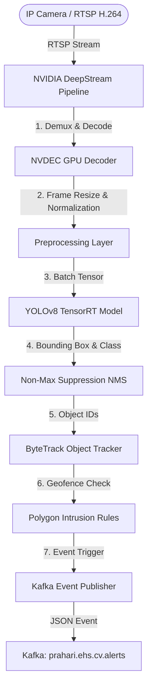

# PRAHARI Platform: Computer Vision Pipeline and Architecture

## 1. Detection Pipeline
The Computer Vision (CV) subsystem ingests live high-definition RTSP streams, executes deep-learning-based object detection and tracking, evaluates geofence boundaries, and dispatches safety alert events to the central messaging system.



- **Decoder**: Offloaded to GPU hardware using NVDEC to keep CPU utilization below 10%.
- **Object Tracker**: **ByteTrack** correlates detected objects across frames to track paths, calculate dwelling time, and suppress transient detection flickers.

---

## 2. Model & Dataset Specifications
- **Base Architecture**: **YOLOv8x (80.1M parameters)** optimized for spatial accuracy.
- **Classes & Labels**:
  - `0`: `person`
  - `1`: `hard_hat`
  - `2`: `safety_vest`
  - `3`: `safety_glasses`
  - `4`: `fire`
  - `5`: `smoke`
  - `6`: `spill`
- **Training Dataset**: Fine-tuned on a custom dataset of 150,000 annotated frames (sourced from open-source safety datasets and internal synthetic data) using PyTorch. Annotated using COCO JSON formats.

---

## 3. Model Optimization & Compilation
To achieve low-latency processing, models are optimized before edge or cloud deployment:
1. **Export to ONNX**: The PyTorch model weights (`.pt`) are exported to ONNX format.
2. **Compile to TensorRT**: Compiles ONNX to a hardware-specific engine file (`.engine`) utilizing **FP16 precision execution**:
   ```bash
   trtexec --onnx=yolov8x_safety.onnx \
           --saveEngine=yolov8x_safety_fp16.engine \
           --fp16 \
           --workspace=4096
   ```

---

## 4. Hardware Profiles & Edge Infrastructure
The CV pipeline supports a hybrid edge-cloud deployment topology.

| Deployment Target | Hardware Specifications | Peak Performance | Target Stream Capacity |
| :--- | :--- | :--- | :--- |
| **Edge Gateway** | NVIDIA Jetson AGX Orin (64GB) | 275 TOPS (INT8) | 16 x 1080p RTSP Streams @ 15 FPS |
| **Edge Micro** | NVIDIA Jetson Orin Nano (8GB) | 40 TOPS (INT8) | 4 x 1080p RTSP Streams @ 10 FPS |
| **Cloud Fallback** | AWS EC2 `g4dn.xlarge` (NVIDIA T4) | 65 TFLOPS (FP16) | 8 x 1080p RTSP Streams @ 15 FPS |

- **Edge Deployment Agent**: **AWS IoT Greengrass** orchestrates container updates, synchronizes YOLO models, and publishes compressed metadata to the AWS Cloud.
- **Inference Runtime**: **Triton Inference Server** executes models within a Docker container, providing dynamic batching and concurrent model execution capabilities.

---

## 5. Latency & Alert Budget
The total end-to-end latency budget for a critical safety violation (e.g., hard-hat missing in a hazardous zone) is capped at **1,500ms**:

```
┌────────────────────────────────────────────────────────────────────────┐
│                        Latency Budget Breakdown                        │
├─────────────────┬─────────────────┬──────────────────┬─────────────────┤
│ Frame Ingest    │ Model Inference │ Rule Engine      │ Push Dispatch   │
├─────────────────┼─────────────────┼──────────────────┼─────────────────┤
│ 80ms            │ 35ms            │ 25ms             │ 150ms           │
│ (RTSP buffering)│ (YOLOv8 FP16)   │ (ByteTrack/Zone) │ (Kafka / App)   │
├─────────────────┴─────────────────┴──────────────────┴─────────────────┤
│                              Total: 290ms                              │
└────────────────────────────────────────────────────────────────────────┘
```
This latency profile ensures real-time safety interventions before hazards escalate.
