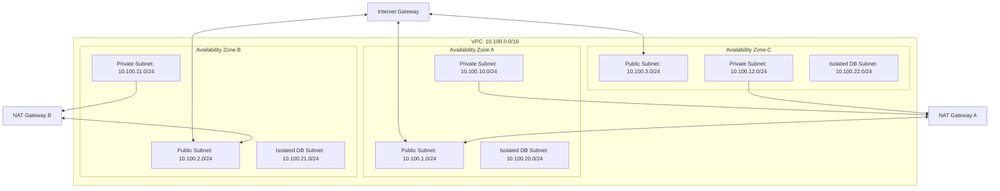

# PRAHARI Platform: AWS Infrastructure Blueprint

## 1. Multi-AZ Network Topography
The AWS infrastructure for PRAHARI is deployed inside a multi-Availability Zone (AZ) Virtual Private Cloud (VPC) spanning three AZs in the target region (`ap-south-1`).

- **Public Subnets**: Host AWS Application Load Balancers (ALB) and NAT Gateways.
- **Private Subnets**: Host the Amazon EKS cluster node groups and Amazon MSK brokers.
- **Isolated Subnets**: Host Amazon Aurora PostgreSQL clusters and Amazon ElastiCache Redis replication groups. No direct routing to NAT Gateways.

---

## 2. Amazon EKS Cluster Architecture
- **Kubernetes Version**: 1.30
- **Node Autoscaling**: Karpenter handles automated provisioning of EC2 instances based on pending pod requirements. Karpenter dynamically matches compute sizes (`c6i` for CPU-intensive Go microservices, `g5` for cloud-based GPU inferencing).
- **Cluster Networking**: Amazon VPC CNI assigns native VPC IP addresses to Kubernetes pods, minimizing network packet overhead.
- **IAM Roles for Service Accounts (IRSA)**: Pods are mapped to dedicated AWS IAM roles via OIDC federation, removing static AWS access keys from application containers.

---

## 3. Storage & Data Persistence

### 3.1 Amazon Aurora PostgreSQL (RDS)
- **Engine**: Aurora PostgreSQL 16.2 (Compatible with pgvector).
- **Configuration**: Multi-AZ deployment with 1 Primary Writer and 2 Reader instances. Aurora Serverless v2 scales CPU and memory dynamically based on active load.
- **Backups**: Continuous backups enabled, point-in-time recovery window set to 14 days. Daily snapshots replicated to secondary region (`ap-northeast-1`).

### 3.2 Amazon MSK (Managed Streaming for Kafka)
- **Engine Version**: 3.7.x
- **Broker Placement**: Distributed across three AZs in the private subnets.
- **Encryption**: TLS in-transit encryption forced. SCRAM-SHA-512 client authentication configured via AWS Secrets Manager integration.

### 3.3 Amazon S3 (Safety Data Sheets & Attachments)
- **Encryption**: Envelope encryption using customer-managed AWS KMS keys.
- **Lifecycle Configuration**:
  - Objects in `active-sds/` transition to **S3 Standard-IA** after 90 days.
  - Objects transition to **S3 Glacier Flexible Retrieval** after 365 days.
  - Objects are deleted/archived permanently after 7 years.

---

## 4. Security & Secrets Management
- **AWS Key Management Service (KMS)**: Dedicated KMS Customer Managed Keys (CMK) encrypt S3 objects, RDS storage volumes, MSK topics, and Secrets Manager values.
- **AWS Secrets Manager**: Stores DB passwords, API credentials, and OIDC client secrets. Secrets rotate every 30 days via automated AWS Lambda functions.
- **SSM Parameter Store**: Stores environment variables, service discovery coordinates, and non-sensitive configuration matrices.

---

## 5. High Availability & Disaster Recovery
- **RTO / RPO Targets**:
  - **Recovery Time Objective (RTO)**: < 15 minutes.
  - **Recovery Point Objective (RPO)**: < 1 minute.
- **Multi-Region Failover**:
  - Global databases (Aurora Global Database) replicate transactions from the primary region (`ap-south-1`) to the DR region (`ap-northeast-1`) with sub-second replication latency.
  - In a failover scenario, **Amazon Route 53** health checks detect primary region ALB unavailability, and route client traffic to the standby cluster in `ap-northeast-1` using failover routing rules.
