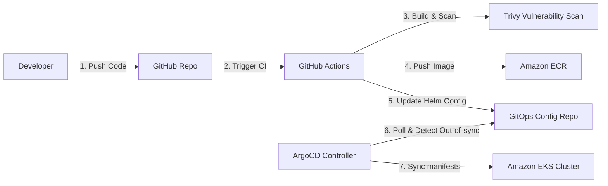

# PRAHARI Platform: Deployment & CI/CD Blueprint

## 1. Containerization (Docker)
Microservices are built using multi-stage Dockerfiles to optimize image sizes and limit vulnerability attack surfaces.

### Go Microservice Dockerfile Pattern (Clean & Secure)
```dockerfile
# Stage 1: Build binary
FROM golang:1.22-alpine AS builder
WORKDIR /app
COPY go.mod go.sum ./
RUN go mod download
COPY . .
RUN CGO_ENABLED=0 GOOS=linux GOARCH=amd64 go build -ldflags="-w -s" -o server cmd/server/main.go

# Stage 2: Distroless production runner
FROM gcr.io/distroless/static-debian12:latest-amd64
COPY --from=builder /app/server /server
COPY --from=builder /app/migrations /migrations
EXPOSE 8080
USER 65532:65532
ENTRYPOINT ["/server"]
```

---

## 2. Infrastructure as Code (Terraform)
Application infrastructure is provisioned using Terraform. 

- **State Management**: Terraform state is stored securely in an Amazon S3 bucket with versioning enabled. State locking is enforced via an Amazon DynamoDB table.
- **Module Structure**:
  ```
  deployments/terraform/
  ├── main.tf                 # Global configuration & provider details
  ├── variables.tf            # Variables configuration
  ├── outputs.tf              # Shared outputs
  └── modules/
      ├── vpc/                # VPC networking
      ├── eks/                # EKS Cluster & node configurations
      ├── rds/                # Aurora PostgreSQL instances
      └── msk/                # Managed Streaming for Apache Kafka
  ```

---

## 3. Kubernetes Orchestration & Helm Charts
Kubernetes workloads are packaged using Helm.

- **Namespace Segregation**:
  - `prahari-core`: Contains primary EHS microservices (Chemical, PHA, Incident).
  - `prahari-edge`: Contains CV alerts listeners and IoT gateway components.
  - `prahari-system`: Contains monitoring agents (Prometheus, Fluent-bit, OTel Collector).
- **Helm Value Overrides**: Chart configurations are driven by environment-specific overrides:
  ```yaml
  # values-production.yaml
  replicaCount: 5
  resources:
    limits:
      cpu: 2000m
      memory: 4Gi
    requests:
      cpu: 500m
      memory: 1Gi
  autoscaling:
    enabled: true
    minReplicas: 3
    maxReplicas: 10
    targetCPUUtilizationPercentage: 75
  ```

---

## 4. CI/CD GitOps Pipeline (GitHub Actions & ArgoCD)
All application deployments use a GitOps methodology driven by GitHub Actions (CI) and ArgoCD (CD).



### 4.1 Continuous Integration (CI)
The GitHub Actions workflow executes tests, runs static code analysis, and builds Docker images:
1. **Linting & Code Verification**: Runs `golangci-lint` and formatting checks.
2. **Security Scan**: Scans source files and dependencies for vulnerabilities using **Trivy**, and Terraform templates using **Checkov**.
3. **Build & Release**: Compiles Docker images, tags them with the git commit SHA, and pushes them to Amazon ECR.
4. **GitOps Bump**: Commits the new tag version to the ArgoCD deployment repository.

### 4.2 GitOps Synchronization (ArgoCD & Argo Rollouts)
ArgoCD maps the GitOps repository state directly to EKS.
- **Canary Deployments**: Implemented using **Argo Rollouts** for core microservices:
  ```yaml
  apiVersion: argoproj.io/v1alpha1
  kind: Rollout
  spec:
    strategy:
      canary:
        steps:
        - setWeight: 10
        - pause: { duration: 10m } # Pause for 10 minutes to verify telemetry
        - setWeight: 50
        - pause: { duration: 30m }
        - setWeight: 100
  ```
- **Automated Rollback**: If Prometheus alerts (e.g., HTTP 5xx error rate > 1%) trigger during a canary phase, Argo Rollouts aborts the step and immediately reverts the cluster state to the previous stable release.
