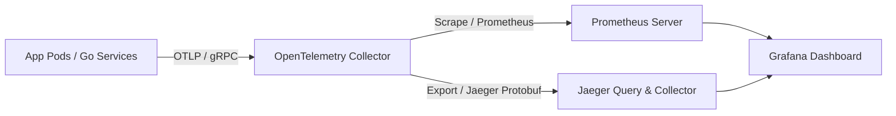

# PRAHARI Platform: Operations and Platform Reliability Guide

## 1. Observability Stack (OTel, Prometheus & Jaeger)
The platform utilizes **OpenTelemetry** as the standard instrument layer to capture traces, metrics, and logs.

- **Metrics Collection**: Microservices expose Prometheus metrics on `/metrics`. A cluster-level Prometheus server scrapes these endpoints every 15 seconds.
- **Trace Context**: Distributed trace headers propagate trace contexts across all gRPC, HTTP, and Kafka exchanges, allowing end-to-end visualization of requests inside the Jaeger UI.

---

## 2. Platform SLA, SLOs & KPIs

### 2.1 Service Level Agreement (SLA)
- The platform guarantees a **99.99% monthly uptime SLA** for core API endpoints, excluding scheduled maintenance windows.

### 2.2 Service Level Objectives (SLOs)
- **API Availability SLO**: 99.99% of HTTP requests to `/api/v1/` must return status codes other than `5xx` over a rolling 30-day window.
- **API Latency SLO**: 99.0% of write requests must complete in `< 250ms`, and 95.0% of read requests must complete in `< 150ms`.
- **Alert Ingestion SLO**: 99.9% of CV events must be published to Kafka and parsed by the alerting service within 200ms of receipt.

---

## 3. Incident Severity Levels & Triage
We categorize production incidents into four severity levels to coordinate operations teams.

| Severity | Impact | Target Response (SLA) | Primary Communication Channel |
| :--- | :--- | :--- | :--- |
| **P1 - Critical** | Core service offline (e.g. Auth down, CV Alerts ingestion failing for a plant). No workaround available. | < 15 minutes | PagerDuty Call / Slack Incident Room |
| **P2 - High** | Major feature unavailable (e.g. PHA study creation failing). Workaround exists but has operational impact. | < 1 hour | Slack Incident Channel |
| **P3 - Medium** | Minor feature bug (e.g. SDS parsing failing for specific chemical structures). | < 24 hours | Jira Ticket / Slack Group |
| **P4 - Low** | Cosmetic issues or documentation typos. | < 5 business days | Jira Backlog |

---

## 4. Runbook Mapping & Maintenance
- **System Runbooks**: High-frequency operational issues are documented under [Operational Runbooks](file:///Users/Santosh/PRAHARI/docs/13_Runbooks/README.md).
- **Scheduled Maintenance**:
  - **EKS Control Plane Upgrades**: Conducted quarterly during low-traffic windows (Sunday 02:00 UTC). Node upgrades are orchestrated progressively using Karpenter node termination parameters to prevent service disruption.
  - **PostgreSQL Version Updates**: Major upgrades are executed using Aurora blue-green deployments to minimize failover downtime to less than 30 seconds.

---

## 5. Capacity & Storage Planning
- **Camera Bandwidth**:
  - Each 1080p stream at 15 FPS using H.264 consumes **~2.5 Mbps**.
  - A plant with 50 camera streams requires **125 Mbps** of stable local network bandwidth. Edge nodes handle frame decoding to keep WAN consumption below **5 Mbps** (alerts metadata only).
- **PostgreSQL Storage Sizing**:
  - Estimated rate of 10 million telemetry events per month.
  - Generates ~15GB of raw data monthly.
  - With partitioning enabled, active metrics partitions are stored on SSD for 90 days (45GB), after which historical tables are moved to cold S3 storage classes.
